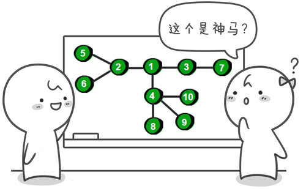
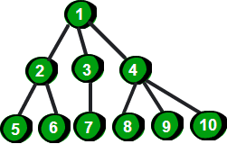
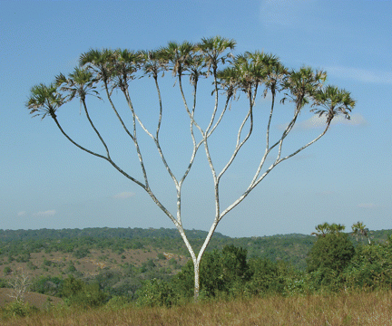
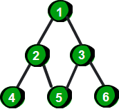
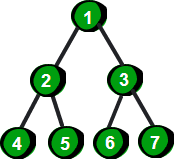
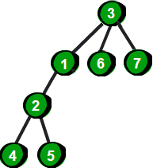
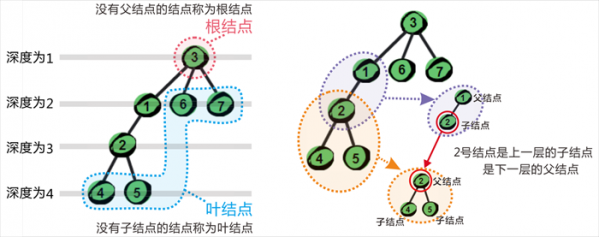

# 算法 9：开启“树”之旅

我们先来看一个例子。



这是什么？是一个图？不对，确切的说这是一棵树。这哪里像树呢？不要着急我们来变换一下。



是不是很像一棵倒挂的树，也就是说它是根朝上，而叶子朝下的。不像？哈哈，看完下面这幅图你就会觉得像啦。



你可能会问：树和图有什么区别？这个称之为树的东西貌似和无向图差不多嘛。不要着急，继续往下看。树其实就是不包含回路的连通无向图。你可能还是无法理解这其中的差异，举个例子，如下。


  

上面这个例子中左边的是一棵树，而右边的是一个图。因为左边的没有回路，而右边的存在 1->2->5->3->1 这样的回路。

1. 正是因为树有着“不包含回路”这个特点，所以树就被赋予了很多特性。
2. 一棵树中的任意两个结点有且仅有唯一的一条路径连通。
3. 一棵树如果有 n 个结点，那么它一定恰好有 n-1 条边。

在一棵树中加一条边将会构成一个回路。树这个特殊的数据结构在哪里会用到呢？比如足球世界杯的晋级图，家族的族谱图、公司的组织结构图、书的目录、我们用的操作系统 Windows、Liunx 或者 Mac 中的“目录（文件夹）”都是一棵树。下面就是“啊哈 C”这个软件的目录结构。

```

    C:\啊哈C
    ├─codes
    ├─core
    │ ├─bin
    │ ├─include
    │ │ ├─ddk
    │ │ ├─gdb
    │ │ ├─gdiplus
    │ │ ├─GL
    │ │ └─sys
    │ ├─lib
    │ │ └─gcc
    │ │ └─mingw32
    │ │ └─4.7.1
    │ │ ├─finclude
    │ │ ├─include
    │ │ │ └─ssp
    │ │ ├─include-fixed
    │ │ └─install-tools
    │ │ └─include
    │ ├─libexec
    │ │ └─gcc
    │ │ └─mingw32
    │ │ └─4.7.1
    │ │ └─install-tools
    │ └─mingw32
    │ ├─bin
    │ └─lib
    │ └─ldscripts
    └─skin

```

假如现在正处于 libexec 文件夹下，需要到 gdiplus 文件夹下。你必须先“向上”回到上层文件夹 core，再进入 include 文件夹，最后才能进入 gdiplus 文件夹。因为一棵树中的任意两个结点（这里就是文件夹）有且仅有唯一的一条路径连通。
       
为了之后讲解的方便，我们这里对树进行一些定义。
       
首先，树是指任意两个结点间有且只有一条路径的无向图。 或者说，只要是没有回路的连通无向图就是树。
       
喜欢思考的同学可能会发现同一棵树可以有多种形态，比如下面这个两棵树。

 

为了确定一棵树的形态，在一棵树中可以指定一个特殊的结点——根。我们在对一棵树进行讨论的时候，将树中的每个点称为结点，有的书中也称为节点。有一个根的树叫做有根树（哎，这不是废话嘛）。比如上方左边这棵树的树根是 1 号结点，右边这棵树的树根是 3 号结点。
       
根又叫做根结点，一棵树有且只有一个根结点。根结点有时候也称为祖先。既然有祖先，理所当然就有父亲和儿子。比如上图右边这棵树中 3 号结点是 1、6 和 7 号结点的父亲，1、6 和 7 号结点是 3 号结点的儿子。同时 1 号结点又是 2 号结点的父亲，2 号结点是 1 号结点的儿子，2 号结点与 4、5 号结点关系也显而易见了。
       
父亲结点简称为父结点，儿子结点简称为子结点。2 号结点既是父结点也是子结点，它是 1 号结点的子结点，同时也是 4 和 5 号结点的父结点。另外如果一个结点没有子结点（即没有儿子）那么这个结点称为叶结点，例如 4、5、6 和 7 号结点都是叶结点。没有父结点（即没有父亲）的结点称为根结点（祖先）。如果一个结点既不是根结点也不是叶结点则称为内部结点。最后每个结点还有深度，比如 5 号结点的深度是 4。哎，终于啰嗦完了，写的我汗都流出来了，没有理解的请看下面这幅插图吧。



说了这么多你可能都没有感受到树究竟有什么好处。不要着急，请看下回——二叉树。

【啊哈！算法】算法 9：开启“树”之旅  
[http://ahalei.blog.51cto.com/4767671/1403823](http://ahalei.blog.51cto.com/4767671/1403823)
    

